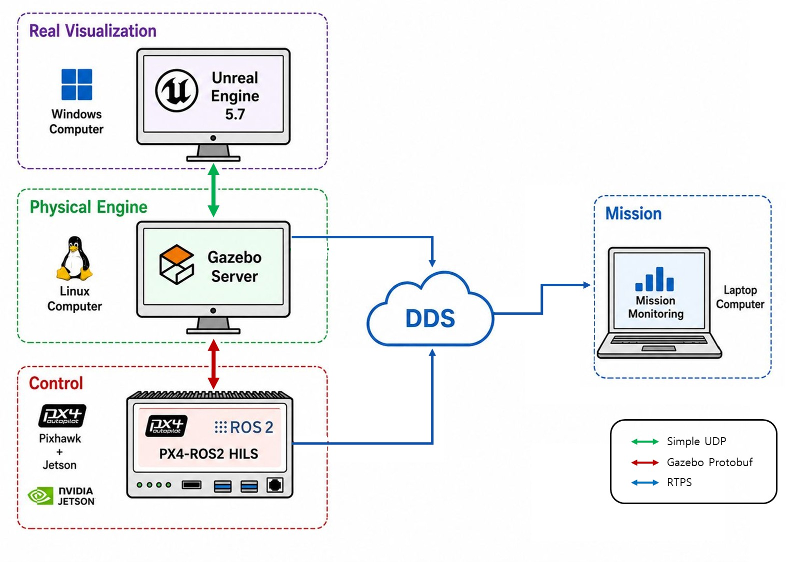

# RealGazebo-ROS2

A multi-vehicle robotics simulation environment that bridges **Gazebo Harmonic**
(physics), **PX4** (autopilot) and **Unreal Engine** (photorealistic rendering)
over a shared ROS 2 Jazzy middleware layer. Heterogeneous fleets — multirotors,
VTOLs, ground rovers and surface vessels — fly in one world, and each vehicle's
autopilot can be a simulated process, a process on a remote PC, or a real
flight controller, without changing the world or the other vehicles.



The diagram above is the deployment this repository targets. Each block is a
separate host, and the three link types map onto concrete interfaces:

| Link in the diagram | What it actually is |
|---|---|
| **Simple UDP** (Gazebo ↔ Unreal) | The `RealGazebo` Gazebo plugin streams pose, motor RPM and servo state to UE on `:5005`. The reverse direction carries runtime spawn/despawn commands to the manager on `:5006` (wire format: `src/realgazebo/realgazebo/protocol.py`). |
| **Gazebo Protobuf** (Gazebo ↔ Control) | The physics world's sensor and actuator topics. For a simulated autopilot PX4 attaches to them directly; for a real board `gz-hitl-bridge` translates them into MAVLink `HIL_SENSOR`/`HIL_GPS` and back from `HIL_ACTUATOR_CONTROLS`. |
| **RTPS** (→ DDS → Mission) | uXRCE-DDS. Every vehicle publishes under `/vehicle{N}`, so a mission or monitoring node on any host in the LAN sees the whole fleet through plain ROS 2 topics. |

Camera imagery is not on the diagram's control path: UE renders EO views and
serves them as RTSP streams (`:8554`), which any consumer — including a
dedicated image-processing PC — pulls over the same Ethernet. A per-vehicle
lifecycle node re-publishes each stream as `/vehicle{N}/camera/{camera}/image_raw`
for consumers that would rather stay in ROS 2, and only holds the stream open
while something is subscribed.

The Physical Engine and the autopilot side are Linux-native. Unreal Engine 5.7
currently runs on Windows in the reference deployment; the visualization side is
moving to a Linux-native build so the entire stack can be deployed on Linux.

---

## Table of contents

- [Quickstart](#quickstart)
- [Execution modes](#execution-modes)
- [Integration and staged verification](#integration-and-staged-verification)
- [Architecture](#architecture)
- [Vehicles, worlds and terrain](#vehicles-worlds-and-terrain)
- [Fleet YAML reference](#fleet-yaml-reference)
- [Building the container image](#building-the-container-image)
- [Repository layout](#repository-layout)
- [License](#license)

---

## Quickstart

### Prerequisites

- Ubuntu 24.04 + ROS 2 Jazzy, or Docker (the published image ships everything)
- Gazebo Harmonic (`gz-sim` 8.x)
- [RealGazebo-PX4](https://github.com/SUV-Lab/RealGazebo-PX4) — supplies the PX4
  SITL binaries, the RealGazebo airframes, and the `gz-hitl-bridge` used by HILS
- An NVIDIA GPU is strongly recommended for camera/LiDAR sensor rendering

### Build from source

```bash
git clone --recursive https://github.com/SUV-Lab/RealGazebo-ROS2.git
cd RealGazebo-ROS2

source /opt/ros/jazzy/setup.bash
colcon build --symlink-install
source install/setup.bash
```

`src/px4_msgs` is a submodule pinned to `release/1.16`; `--recursive` (or a
later `git submodule update --init`) is required.

The c-track site mesh is ~1.25 GB and is downloaded by CMake at build time. To
skip it entirely and bring your own world:

```bash
colcon build --cmake-args -DWORLD_CTRACK=false
```

### Run — single container (monolithic)

Every vehicle runs as a subprocess next to the Gazebo server. Simplest to start,
best for development on one machine.

```bash
# Empty world; vehicles arrive at runtime over UDP :5006
./scripts/run_realgazebo.sh

# Or boot a fleet from YAML
./scripts/run_realgazebo.sh src/realgazebo/yaml/sitl.yaml

# Options: --gui, --no-gpu, --unreal-ip IP, --world NAME, --terrain NAME
```

Or, inside an already-sourced Jazzy environment:

```bash
ros2 launch realgazebo manager_sim.launch.py yaml_path:=<fleet.yaml>
```

### Run — one container per vehicle

The manager allocates per-vehicle addresses, ports and DDS profiles and creates
sibling containers through the Docker API. Better isolation, and the mode used
when per-vehicle resource limits or network shaping matter.

```bash
./scripts/start_compose_simulation.sh                                # empty world
./scripts/start_compose_simulation.sh src/realgazebo/yaml/sitl.yaml  # boot a fleet

# Options: --gui, --dev, --unreal-ip/--unreal-port, --world, --terrain, --image

./scripts/stop_compose_simulation.sh    # tears down stray vehicle containers too
```

### When any remote host takes part

`GZ_IP` **must** name the simulation host's LAN address whenever a remote PC or
a real flight controller participates. The default `127.0.0.1` keeps the world
invisible to other hosts, and the same switch arms the FastDDS interface
whitelist that remote uXRCE agents depend on:

```bash
GZ_IP=10.41.10.1 ./scripts/run_realgazebo.sh fleet.yaml
```

---

## Execution modes

Where a vehicle's autopilot runs is a per-vehicle property, set by `mode:` in
the fleet YAML. **All three mix freely in a single fleet** — the same world, the
same identity scheme, the same ROS 2 topics.

| `mode` | Where PX4 runs | YAML needs | Guide |
|---|---|---|---|
| *(default)* / `sitl` | A subprocess or container on the simulation host | `build_target` | — |
| `pils` | PX4 SITL on a **separate PC**, attaching to the shared world over gz-transport | nothing beyond `mode` | [`docs/PILS.md`](docs/PILS.md) |
| `hitl` | A **real flight controller** driven through `gz-hitl-bridge` | `fc:` (serial or UDP) | [`docs/HITL.md`](docs/HITL.md) |

Everything else is derived from the vehicle's numeric key `N` and never varies
by mode:

| Property | Value |
|---|---|
| Gazebo model name | `{type}_{N}` |
| ROS 2 namespace | `/vehicle{N+1}` |
| MAVLink system id | `N + 1` |
| HILS bridge local port | `14600 + N` |
| Unreal instance | `N` |

Because identity is mode-independent, a mission node cannot tell whether
`/vehicle3` is a simulated autopilot, a remote one, or a real board — which is
what makes the verification ladder below work without touching mission code.

---

## Integration and staged verification

RealGazebo is designed to be integrated against by **independent teams that do
not share a process, a language, or a machine**. The agreed integration approach
is that each participating team packages its algorithm as its own container. A
container's only contract with the simulator is ROS 2 / DDS: it subscribes to
the vehicle state and sensor topics it needs under `/vehicle{N}`, and publishes
commands back. Nothing about the simulator's internals — Gazebo plugins, PX4
build, UE link — is part of that contract, so teams can iterate independently
and integration reduces to putting the containers on one DDS domain.

Integration is then verified in three stages, each of which is an existing
execution mode rather than a separate build:

| Stage | Configuration | Mode | What it proves |
|---|---|---|---|
| **1** | Every team's container **and** the simulator on one PC | `sitl` | The interface contract itself: topic names, message types, rates, control-loop stability. No network variables. |
| **2** | One PC per team, connected over the LAN | `pils` | The same algorithms across a real network: DDS discovery across hosts, bandwidth, latency and jitter, multi-host clock behaviour. |
| **3** | Real **PX4 + Jetson** boards in the loop | `hitl` | The real autopilot's timing and its real companion computer. The flight code executing is the flight code that ships. |

Stage 2 is the software twin of stage 3: a PILS PC plays the flight controller
while hosting the companion side (uXRCE agent + mission) exactly as a Jetson
does next to a real board. Moving a vehicle from stage 2 to stage 3 is a
one-line YAML change, so an algorithm can be developed against PILS and
re-verified on hardware without restructuring anything.

### Reference deployment

The topology in the diagram at the top has been exercised end to end:

- **Physical Engine PC** (Linux) — Gazebo server + the RealGazebo manager, the
  single authority for the world and every vehicle model
- **Visualization PC** — Unreal Engine, receiving pose/actuator state over UDP
  and rendering EO views back out as RTSP
- **Mission PC** — mission and monitoring nodes, plain ROS 2 over DDS
- **Flight controller + Jetson companion** — the HILS vehicle; PX4 exchanges
  MAVLink HIL with the bridge while its own uXRCE agent runs on the Jetson

EO and LiDAR output is deliberately kept off the control path so that
image-processing load can be moved to whichever host has the capacity — in the
reference setup it is streamed over Ethernet to a separate computer.

Multi-board HILS has been brought up successfully; scaling it further is a
matter of tuning rather than missing capability. The known-sharp edges are
documented in [`docs/HITL.md`](docs/HITL.md) — in particular the per-FC MAVLink
instance split (QGC on `:14550`, HIL on a dedicated `:14560`), running each
board's uXRCE agent on **its own** companion, and the DDS interface whitelist
that keeps fleet-scale discovery from collapsing.

A ready-made mixed fleet is provided as
[`src/realgazebo/yaml/example.yaml`](src/realgazebo/yaml/example.yaml) — ten
vehicles in one world with the execution mode split across all three backends,
so a single run exercises every stage at once.

---

## Architecture

### Packages

| Package | Language | Purpose |
|---|---|---|
| `realgazebo` | C++ / Python | Core: Gazebo plugins, launch files, worlds, models, fleet manager |
| `realgazebo_msgs` | IDL | Fault-injection message definitions |
| `px4_msgs` | *(submodule)* | PX4 ROS 2 message definitions |
| `network_sim` | C++ | V2V link modelling; applies real impairment via Linux TC/netem |
| `drone_controller` | Python | Vehicle control utility nodes |
| `image_viewer` | Python | RTSP image stream control (lifecycle node) |
| `manager` | Python | Vehicle management utilities |

### The manager

`src/realgazebo/realgazebo/manager_node.py` owns fleet lifecycle. It allocates
per-vehicle resources (addresses, ports, DDS profiles), spawns vehicles through
the backend selected by `mode:`, starts each vehicle's extras (camera receivers,
sensor bridges), and tears everything down on despawn or shutdown. It listens
for spawn/despawn commands on UDP `:5006` for the whole run, so vehicles can be
added and removed while the world is running — the Unreal plugin is the usual
sender.

### Gazebo plugins (`src/realgazebo/plugins/`)

| Plugin | Role |
|---|---|
| `RealGazebo` | Streams pose, motor RPM and servo state to Unreal over UDP; subscribes to PX4 battery/status topics |
| `MotorFailureROS2` | Motor failure injection — overrides joint velocities via `/motor_failure/ratios` |
| `ServoFailureROS2` | Control-surface failure injection via `/servo_failure/commands` |
| `ImuFaultROS2` | IMU fault injection (bias / drift / oscillation, with activation windows and ramp-in) under `/<model>/imu_fault/*`. PX4 simply sees corrupted IMU values. |
| `ImageReceiver` | Lifecycle node managing RTSP capture; opens and closes the stream based on subscriber count |

### Networking

Multi-container mode uses two Docker networks:

| Network | Subnet | Carries |
|---|---|---|
| `gazebo-network` | `172.20.0.0/16` | Gazebo transport (multicast discovery) |
| `vehicle-network` | `172.30.0.0/16` | DDS / ROS 2, isolated per vehicle |

Ports:

| Port | Direction | Purpose |
|---|---|---|
| `5005/udp` | sim → UE | Pose, motor RPM, servo state |
| `5006/udp` | UE → sim | Runtime spawn / despawn / prop move |
| `8554/tcp` | UE → consumers | RTSP camera streams — `rtsp://<ue_ip>:8554/{type}_{id}/{camera}` |
| `14550/udp` | FC ↔ QGC | Ground station link (never used by the bridge) |
| `14560/udp` | FC ↔ bridge | Dedicated HIL MAVLink instance |
| `14600+N/udp` | bridge, local | Bound per HILS vehicle |
| `8888/udp` | FC → companion | uXRCE-DDS agent |

### Runtime spawn protocol

A 3-byte header — `entity_id`, `type_code`, `message_id` — followed by an
optional payload. `message_id 1` carries a pose (7 little-endian float32:
position + quaternion, Gazebo frame) and acts as an upsert: an unknown id
spawns, a known prop id moves. `message_id 4` despawns. Type codes `0..199` are
PX4 vehicles; `>= 200` are static props with no autopilot stack. Full
definition: [`src/realgazebo/realgazebo/protocol.py`](src/realgazebo/realgazebo/protocol.py).

---

## Vehicles, worlds and terrain

### Vehicle types

Types and their wire codes come from the `<type_code>` tag in the SDF templates
under `src/realgazebo/models/` — a single source of truth read by both the
manager and the Gazebo plugin, so adding a type needs no code change on either
side.

| Type | Code | Notes |
|---|---|---|
| `x500` | 0 | Quadrotor |
| `rover_ackermann` | 1 | Ackermann-steered ground vehicle |
| `boat` | 2 | Surface vessel |
| `lc_62` | 3 | VTOL |
| `x500_lidar_2d` | 5 | Quadrotor + 2D LiDAR |
| `x500_lidar_3d` | 6 | Quadrotor + 3D LiDAR |
| `rock` | 201 | Static prop — no PX4, no container; movable at runtime |

Vehicles with a LiDAR get a `ros_gz_bridge` instance automatically: the manager
scans the rendered SDF for `gpu_lidar` sensors and publishes `/vehicle{N}/scan`
and `/vehicle{N}/scan/points`.

### `world` and `terrain` are independent

Two separate launch arguments, both defaulting to `c-track`. They are easy to
conflate and used to be one argument:

- **`world`** — *which world runs*. Loads `worlds/<world>.sdf`. The Gazebo world
  name (which must equal the file name) is the root of every Gazebo topic and
  service, so the manager, `PX4_GZ_WORLD`, the sensor bridges and `network_sim`
  all address it.
- **`terrain`** — *which STL the shipped c-track terrain model displays*.
  `c-track` is the full site; `urban` and `vils` are smaller crops of the same
  site, so a small-scale run need not load the full 1.15 GB mesh. It never
  affects the world name, and worlds that do not include `model://c-track`
  ignore it.

Neither has an allow-list: add a world by dropping in `worlds/<name>.sdf`, add a
terrain crop by dropping in `models/c-track/meshes/<name>.stl`.

### Bring your own world

`worlds/<name>.sdf` plus `--world <name>` is all it takes. Nothing
RealGazebo-specific belongs in a world file — every RealGazebo plugin attaches
to vehicle models, and Gazebo system plugins come from PX4's `server.config`.

---

## Fleet YAML reference

```yaml
px4_target:
  # 0 must be a RealGazebo-PX4 build target. It supplies the SITL binaries
  # and the gz-hitl-bridge; PILS vehicles never touch it.
  0 : /home/user/realgazebo/RealGazebo-PX4

vehicles:
  # SITL — PX4 runs on the simulation host
  0 :
    type : x500
    build_target : 0
    spawnpoint : (18.846, 14.751, -1.3, -3.14)   # x, y, z, yaw[rad]

  # PILS — PX4 runs on a remote PC; nothing else to declare here
  1 :
    type : x500_lidar_3d
    mode : pils
    spawnpoint : (-24.458, -12.013, 0.3, -3.14)

  # HILS — a real flight controller over Ethernet
  2 :
    type : lc_62
    mode : hitl
    spawnpoint : (18.846, -19.053, -0.8, -3.14)
    fc :
      udp : 10.41.10.31:14560
      # local_port : 14602   # optional; defaults to 14600 + key. NEVER 14550.
    # sys_id : 3             # optional; defaults to key + 1
    # qgc_relay : false      # optional; auto (on for serial, off for Ethernet)

  # HILS — a real flight controller over USB serial
  3 :
    type : rover_ackermann
    mode : hitl
    spawnpoint : (0.0, 12.0, 0.2, 0.0)
    fc :
      device : /dev/ttyACM0
      baud : 921600
```

Shipped examples under `src/realgazebo/yaml/`:

| File | Fleet |
|---|---|
| `one_drone.yaml` | Single `x500`, SITL |
| `sitl.yaml` | 10 vehicles, all SITL |
| `pils.yaml` | 2 vehicles, all PILS |
| `hitl.yaml` | 3 real flight controllers — Ethernet and serial side by side |
| `example.yaml` | The 10-vehicle fleet with the mode split across all three backends |

Launching a PILS vehicle from the remote PC, once the simulation is up:

```bash
./scripts/run_pils_vehicle.sh <type> <id> <sim_ip> [qgc_ip] [world]
```

Start order matters — the simulation first, then the PILS containers. A PILS
container waits ~30 s for the world and then exits.

---

## Building the container image

The published image is `aware4docker/realgazebo:aware4`. Scripts pull it
automatically; to bake it yourself:

```bash
cd docker
docker build -f Dockerfile \
  --build-arg ROS2_REF=aware4 --build-arg PX4_REF=aware4 \
  -t aware4docker/realgazebo:aware4 .
```

Two things that bite:

- **The build context is `docker/`, not the repository root.** `docker/Dockerfile`
  refers to `scripts/entrypoint.sh`, which lives in `docker/scripts/`. Building
  from the root fails at the last step.
- **`ROS2_REF` / `PX4_REF` are not optional here.** They default to the
  versioned release line, so omitting them bakes that line rather than `aware4`.

Other Dockerfiles: `docker/Dockerfile.dev` layers the working tree over an
existing image for testing local changes; `docker/Dockerfile.publish` bakes from
a pushed branch.

---

## Repository layout

```
docker/                   Image definitions (full bake, dev overlay, publish)
docs/                     HITL and PILS operator guides, architecture diagram
scripts/                  Launch, teardown and utility scripts
  run_realgazebo.sh         monolithic simulation
  start_compose_simulation.sh / stop_compose_simulation.sh
  run_pils_vehicle.sh       remote PX4 for a PILS vehicle
  inject_imu_fault.py       IMU fault injection client
src/realgazebo/
  launch/                 Launch files (manager, gazebo, per-vehicle, demos)
  models/                 Vehicle SDF Jinja2 templates, terrain, props
  nodes/                  image_receiver lifecycle node
  plugins/                Gazebo system plugins
  realgazebo/             Manager: allocator, backends, protocol, registry
  worlds/                 World SDF files
  yaml/                   Example fleet configurations
```

## Testing and linting

```bash
colcon test
colcon test --packages-select realgazebo
```

Python is linted with `ament_flake8`, `ament_pep257` and `ament_copyright`; C++
with `cppcheck`.

## License

GNU General Public License v3.0 — see [LICENSE](LICENSE).
